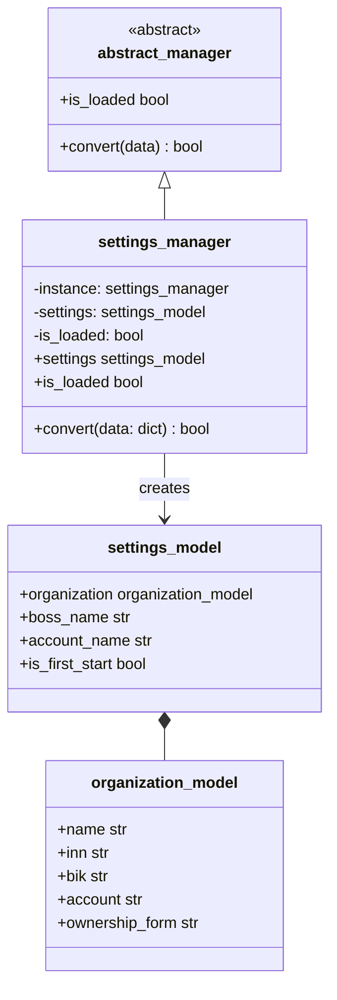
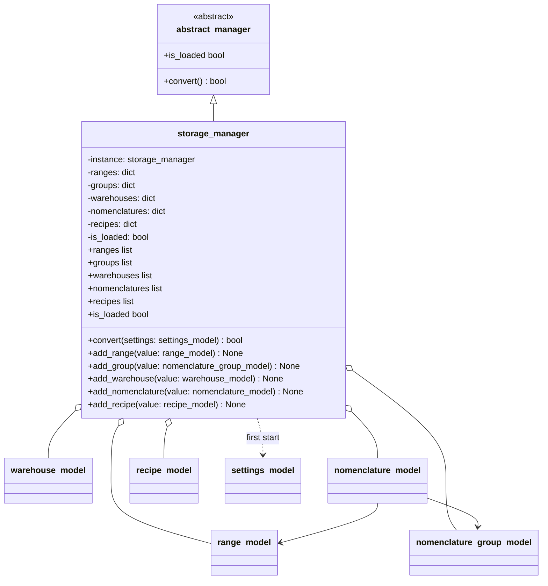

# UML-диаграммы менеджеров

## Менеджер настроек

`settings_manager` реализует шаблон Singleton: все вызовы конструктора
возвращают один экземпляр, а повторный вызов `__init__` не сбрасывает данные.

## Менеджер хранилища

Коллекции реализованы словарями с идентификаторами моделей в качестве ключей.
Это сохраняет уникальность объектов и делает повторное добавление идемпотентным.
