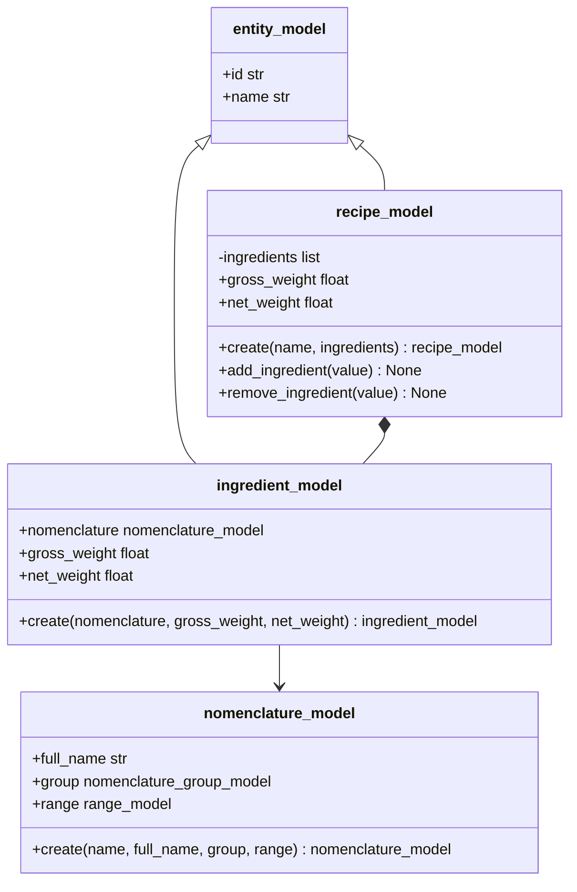

# UML-диаграмма моделей рецепта

`recipe_model` вычисляет веса брутто и нетто при обращении к свойствам,
складывая соответствующие веса всех строк. Поэтому добавление или исключение
ингредиента сразу отражается на итогах технологической карты.
